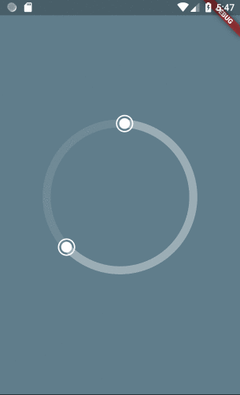

# flutter_circular_slider

[](https://travis-ci.com/davidanaya/flutter-circular-slider) [](https://opensource.org/licenses/MIT)

A customizable circular slider for Flutter.

## Getting Started

- [Installation](#installation)
- [Basic Usage](#basic-usage)
- [Constructor](#constructor)
- [Use Cases](#use-cases)
  - [Basic](#basic)
  - [Pagination](#pagination)
  - [Control buttons](#control-buttons)
  - [Controller](#controller)
  - [Autoplay](#autoplay)

### Installation

Add

```bash

flutter_circular_slider : ^lastest_version

```

to your pubspec.yaml, and run

```bash
flutter packages get
```

in your project's root directory.

### Basic Usage

Create a new project with command

```
flutter create myapp
```

Edit lib/main.dart like this:

```dart
import 'package:flutter/material.dart';

import 'package:flutter_circular_slider/flutter_circular_slider.dart';

void main() => runApp(MyApp());

class MyApp extends StatelessWidget {
  @override
  Widget build(BuildContext context) {
    return MaterialApp(
      theme: ThemeData(
        primarySwatch: Colors.blue,
      ),
      home: MyHomePage(),
    );
  }
}

class MyHomePage extends StatelessWidget {
  @override
  Widget build(BuildContext context) {
    return Scaffold(
        backgroundColor: Colors.blueGrey,
        body: Center(
          child: Container(child: CircularSlider(100, 0, 20)),
        ));
  }
}
```



### Constructor

| Parameter           |                  Default                  | Description                                                                                  |
| :------------------ | :---------------------------------------: | :------------------------------------------------------------------------------------------- |
| intervals           |                                           | The number of sections in which the circle will be divided for selection.                    |
| init                |                                           | The initial value in the selection. Has to be bigger than 0 and smaller than intervals.      |
| end                 |                                           | The end value in the selection. Has to be bigger than 0 and smaller than intervals.          |
| height              |                   220.0                   | Set to `true` enable auto play mode.                                                         |
| width               |                   220.0                   | Called with the new index when the user swiped or autoplay                                   |
| child               |                   null                    | Widget that will be inserted in the center of the circular slider.                           |
| onSelectionChange   | void onSelectionChange(int init, int end) | Triggered every time the user interacts with the slider and changes the init and end values. |
| baseColor           |    Color.fromRGBO(255, 255, 255, 0.1)     | The color used for the base of the circle.                                                   |
| selectionColor      |    Color.fromRGBO(255, 255, 255, 0.3)     | The color used for the selection in the circle.                                              |
| handlerColor        |               Colors.white                | The color used for the handlers.                                                             |
| handlerOutterRadius |                   12.0                    | The radius for the outter circle around the handler.                                         |

### Use Cases

### Sleep Time Selection

```dart
import 'dart:math';

import 'package:flutter/material.dart';

import 'package:flutter_circular_slider/flutter_circular_slider.dart';

void main() => runApp(MyApp());

class MyApp extends StatelessWidget {
  @override
  Widget build(BuildContext context) {
    return MaterialApp(
      theme: ThemeData(
        primarySwatch: Colors.blue,
      ),
      home: MyHomePage(),
    );
  }
}

class MyHomePage extends StatelessWidget {
  @override
  Widget build(BuildContext context) {
    return Scaffold(
        body: SafeArea(
      child: Container(
          decoration: BoxDecoration(
            image: DecorationImage(
              image: AssetImage('images/background_morning.png'),
              fit: BoxFit.cover,
            ),
          ),
          child: SleepPage()),
    ));
  }
}

class SleepPage extends StatefulWidget {
  @override
  _SleepPageState createState() => _SleepPageState();
}

class _SleepPageState extends State<SleepPage> {
  final baseColor = Color.fromRGBO(255, 255, 255, 0.3);

  int initTime;
  int endTime;

  int inBedTime;
  int outBedTime;

  @override
  void initState() {
    super.initState();
    _shuffle();
  }

  void _shuffle() {
    setState(() {
      initTime = _generateRandomTime();
      endTime = _generateRandomTime();
      inBedTime = initTime;
      outBedTime = endTime;
    });
  }

  void _updateLabels(int init, int end) {
    setState(() {
      inBedTime = init;
      outBedTime = end;
    });
  }

  @override
  Widget build(BuildContext context) {
    return Column(
      mainAxisAlignment: MainAxisAlignment.spaceEvenly,
      children: [
        Text(
          'How long did you stay in bed?',
          style: TextStyle(color: Colors.white),
        ),
        CircularSlider(
          288,
          initTime,
          endTime,
          height: 220.0,
          width: 220.0,
          baseColor: Color.fromRGBO(255, 255, 255, 0.1),
          selectionColor: baseColor,
          handlerColor: Colors.white,
          handlerOutterRadius: 12.0,
          onSelectionChange: _updateLabels,
          child: Padding(
            padding: const EdgeInsets.all(12.0),
            child: Center(
                child: Text('${_formatIntervalTime(inBedTime, outBedTime)}',
                    style: TextStyle(fontSize: 36.0, color: Colors.white))),
          ),
        ),
        Row(mainAxisAlignment: MainAxisAlignment.spaceEvenly, children: [
          _formatBedTime('IN THE', inBedTime),
          _formatBedTime('OUT OF', outBedTime),
        ]),
        FlatButton(
          child: Text('S H U F F L E'),
          color: baseColor,
          textColor: Colors.white,
          shape: RoundedRectangleBorder(
            borderRadius: BorderRadius.circular(50.0),
          ),
          onPressed: _shuffle,
        ),
      ],
    );
  }

  Widget _formatBedTime(String pre, int time) {
    return Column(
      children: [
        Text(pre, style: TextStyle(color: baseColor)),
        Text('BED AT', style: TextStyle(color: baseColor)),
        Text(
          '${_formatTime(time)}',
          style: TextStyle(color: Colors.white),
        )
      ],
    );
  }

  String _formatTime(int time) {
    if (time == 0 || time == null) {
      return '00:00';
    }
    var hours = time ~/ 12;
    var minutes = (time % 12) * 5;
    return '$hours:$minutes';
  }

  String _formatIntervalTime(int init, int end) {
    var sleepTime = end > init ? end - init : 288 - init + end;
    var hours = sleepTime ~/ 12;
    var minutes = (sleepTime % 12) * 5;
    return '${hours}h${minutes}m';
  }

  int _generateRandomTime() => Random().nextInt(288);
}
```


